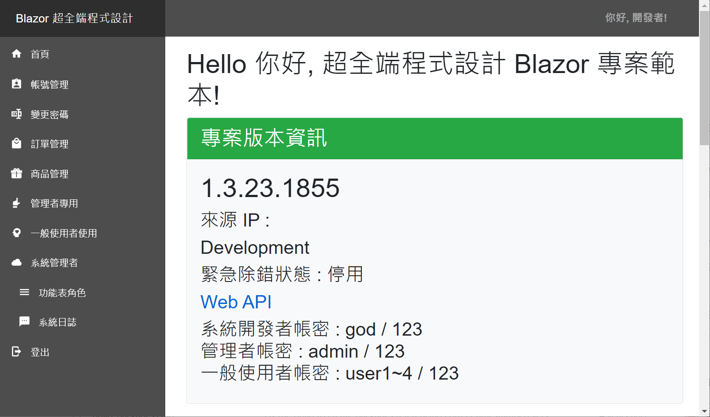
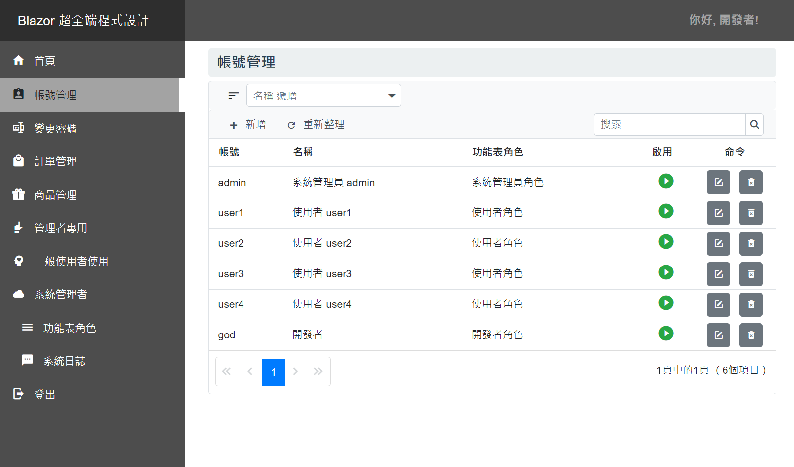
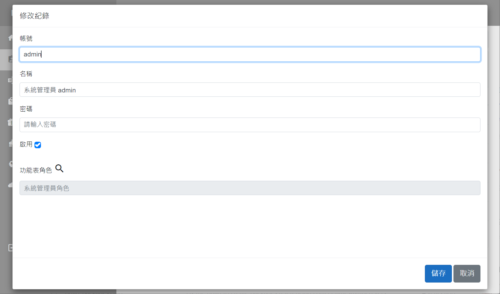
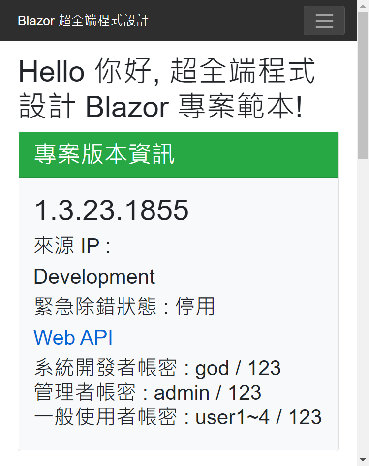
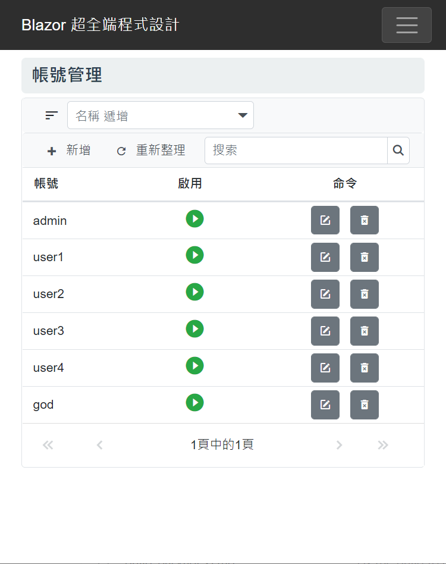
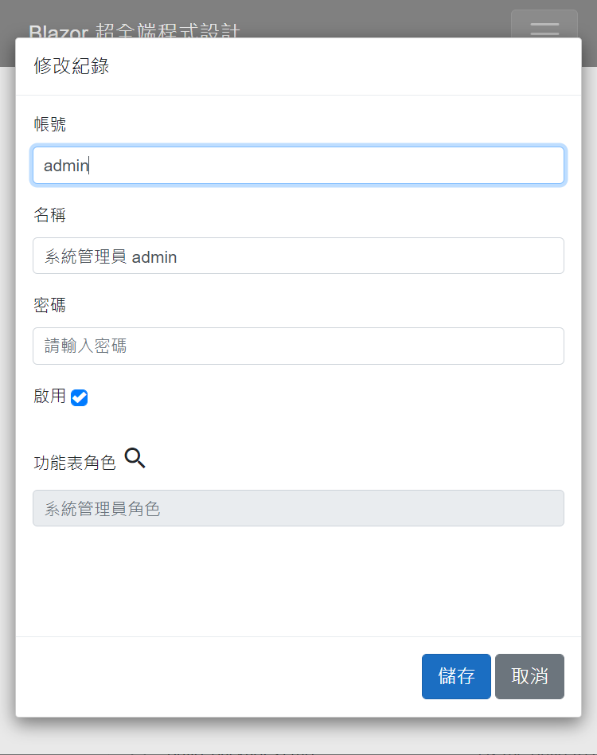
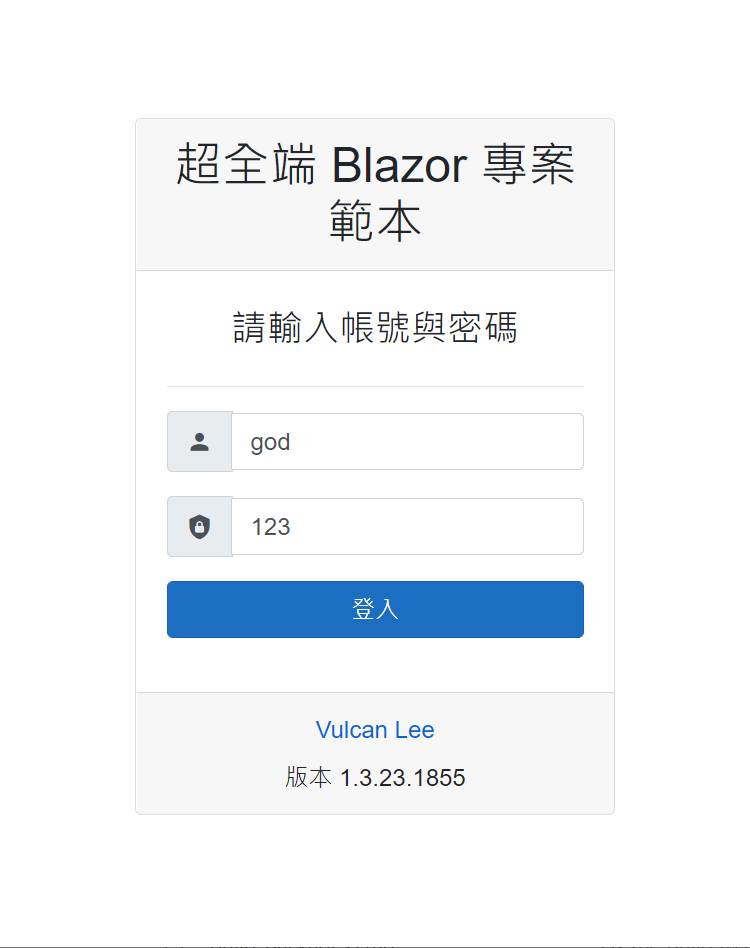

# Blazor + Xamarin 超全端程式設計 動手練習系列 電子書專案原始碼

## 模板應用程式展示

[https://backendhol.azurewebsites.net/](https://backendhol.azurewebsites.net/)

## 主要特色

* 提供 Cookie & Jwt 的身分認證與授權
* 內建使用者紀錄 CRUD
* 內建功能表角色 CRUD
* 內建功能表項目清單 CRUD
* 提供 單一 資料表的 CRUD 範例程式碼
  * 產品清單
* 提供 一對多 資料表的 CRUD 範例程式碼 
  *  訂單 與 訂單明細
* 提供登入時候可以拒絕已經停用的帳號
* 若帳號突然被停用，在設定的時間間隔內，將會強制登出被停用的帳號
* 具有 [緊急除錯模式] ，一旦啟用之後，就算在 Production 模式下，也會啟用 app.UseDeveloperExceptionPage()

  > 一旦發生例外異常，可以按下 F12 來查看當時發生的例外異常
* 

## 螢幕截圖

### 超全端程式設計樣板 電腦版

首頁

紀錄瀏覽

紀錄修改

登入

### 超全端程式設計樣板 手機板

首頁

紀錄瀏覽

紀錄修改

登入

